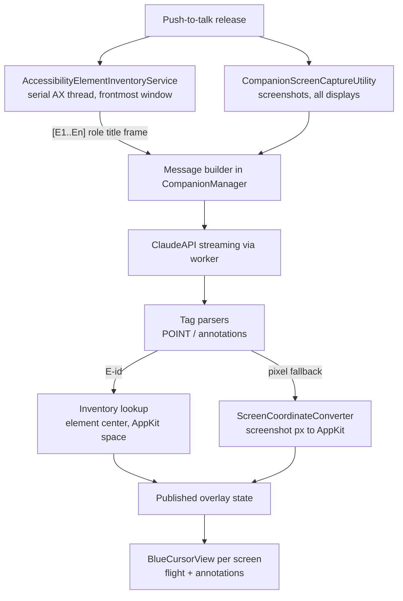
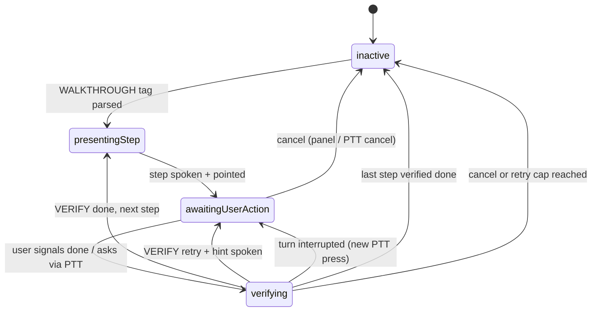
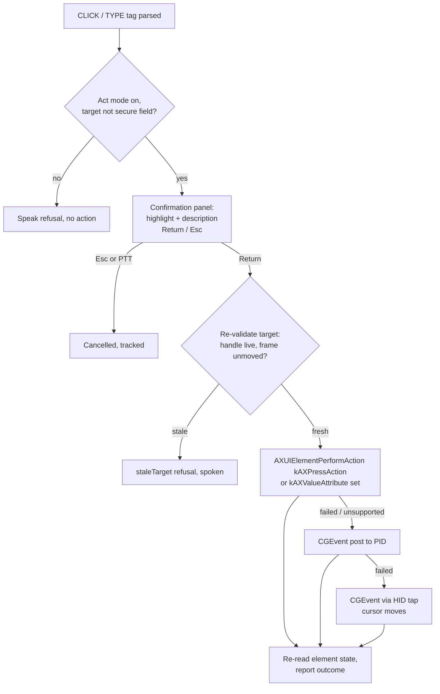

# feat: AX-grounded pointing, annotations, guided walkthroughs, and act mode

## Summary

Replace Clicky's pixel-guess pointing with grounding in the macOS Accessibility (AX) tree, then build three capabilities on top of that foundation: multi-shape screen annotations, guided multi-step walkthroughs with verification, and a confirmation-gated "do it for me" mode that can click and type on the user's behalf. Delivered as four sequential phases (A–D); each phase ships independently.

## Problem Frame

Today Claude guesses integer pixel coordinates from a 1280px-downscaled screenshot and emits a single end-anchored `[POINT:x,y:label:screenN]` tag. Accuracy is limited by vision-based coordinate estimation, only one element can be referenced per response, the interaction is one-shot (no follow-through on whether the user succeeded), and Clicky can show but never do. The AX tree gives exact element frames, names, and roles — the grounding that makes precise pointing, rich annotation, step verification, and safe action execution all possible from one investment.

---

## Requirements

**AX-grounded pointing (Phase A)**

- R1. Clicky enumerates actionable UI elements (role, title, frame) of the frontmost window via the Accessibility API and includes a compact element inventory in Claude's context alongside the screenshots.
- R2. Claude can point at an element by inventory ID; pointing resolves to the element's exact on-screen center instead of a scaled pixel guess.
- R3. Pixel-coordinate pointing remains a working fallback when no AX data is available (stub trees, games, video content, walk failure).
- R4. AX traversal never blocks the main thread and is bounded by an element cap and a per-call messaging timeout.
- R5. The dead `leanring-buddy/ElementLocationDetector.swift` (unreferenced Computer Use client that bypasses the worker proxy) is deleted.

**Annotation overlay (Phase B)**

- R6. The tag grammar supports `BOX`, `CIRCLE`, `ARROW`, and `HIGHLIGHT` annotations — multiple per response, each targetable by element ID or pixel coordinates, on any connected screen.
- R7. Annotations render in the existing per-screen transparent overlay using `DS` design-system tokens, follow the transient-cursor fade lifecycle, and never intercept mouse events.

**Guided walkthroughs (Phase C)**

- R8. Claude can declare a multi-step walkthrough; Clicky presents one step at a time: point/annotate, wait for the user to act, re-capture screen + AX inventory, verify, then advance or retry.
- R9. Walkthrough progress (step n of m, current instruction) is visible on the overlay, and the user can signal completion, ask for help, or cancel at any point via push-to-talk or the panel.
- R10. Step verification is a fresh Claude turn with a new screenshot and AX inventory; Claude returns an advance/retry verdict with an optional corrective hint.

**Act mode (Phase D)**

- R11. `CLICK` and `TYPE` tags perform real input only after explicit per-action user confirmation, with the pending action previewed on screen (target highlight + the target's own role/title from the inventory + Claude's plain-language description); unconfirmed actions expire after ~15s as cancelled.
- R12. Action execution re-validates the target immediately before acting and prefers AX-native mechanisms (`kAXPressAction`, `kAXValueAttribute` set), falling back to CGEvent synthetic input; it refuses secure text fields, system-wide secure input mode, control characters in typed payloads, and a named set of security UI processes.
- R13. A global cancel (Esc or any push-to-talk press) aborts pending and in-flight actions, and synthetic input pauses while the user is physically moving the mouse or typing.
- R14. Act mode is off by default and toggleable from the menu bar panel; every executed or cancelled action is tracked in analytics.

---

## Key Technical Decisions

- **AX inventory as text context, screenshots stay primary.** The element inventory is rendered as a compact text block (one line per element: `[E12] AXButton "Submit" (812,440 96x28)`) appended to the existing image message. Vision remains the primary signal; AX grounds the references. Rationale: smallest change to the proven pipeline, and Claude can cross-check vision against structure. Inventory frames are rendered in screenshot-pixel space (converted via `ScreenCoordinateConverter`) so the text block and the images share one coordinate space — without this, Claude sees display-point numbers that disagree with the pixel space the prompt teaches, sabotaging the cross-check this decision exists for; display-point frames stay internal for resolution. Inventory capped to keep token cost bounded (start at 150 elements in prompt, prioritized by visible area before truncation, tune during implementation).
- **Element IDs over coordinates in the grammar.** `[POINT:E12:label]` resolves through the stored inventory to an exact AppKit-space center, bypassing the screenshot-pixel scaling path entirely. The legacy `[POINT:x,y:label:screenN]` pixel form stays as documented fallback (R3). IDs are stable for a single walk only; each interaction re-walks.
- **Dedicated serial AX thread.** All `AXUIElement` calls run on one dedicated serial background thread — never concurrent, never on main. The AX C API's thread safety is undocumented and practitioner reports of cross-thread issues are common; the serialized-background pattern is what shipping tools (Hammerspoon, window managers, computer-use agents) use. `AXUIElementSetMessagingTimeout` set to ~1s so one hung app cannot stall a walk (default is ~6s per call).
- **Electron/Chromium wake protocol.** Chromium-based apps ship a stub AX tree until prompted. Try `AXManualAccessibility = true` first (side-effect-free, but unsupported in some Electron versions), fall back to `AXEnhancedUserInterface = true`, re-walk after a short retry window, and restore the attribute's original value after the walk — `AXEnhancedUserInterface` left on breaks window managers and window positioning (Rectangle/yabai precedent).
- **One coordinate converter.** AX returns CG global coordinates (top-left origin of the primary display); the app's overlay pipeline is AppKit global (bottom-left). A new `ScreenCoordinateConverter` centralizes CG↔AppKit conversion (flip against `NSScreen.screens[0].frame.maxY`, never `NSScreen.main`) and absorbs the screenshot-pixel→AppKit block currently duplicated in `CompanionManager.swift` (main pipeline + onboarding demo). CG-space values pass to `CGEvent` unconverted — AX and CGEvent share a coordinate space.
- **Multi-tag scanning parser, end-anchored POINT preserved.** Annotation/action tags are parsed by scanning the full response (multiple tags per response), while the existing end-anchored `parsePointingCoordinates` regex behavior is preserved for POINT. All tags are stripped before TTS and history, following the existing pattern. Parsers are pure static functions returning result structs — the codebase's established testable shape.
- **Walkthrough state lives beside, not inside, `CompanionVoiceState`.** A new `WalkthroughController` owns step state and publishes a parallel `WalkthroughPhase` (`inactive / presentingStep / awaitingUserAction / verifying`). The 4-case `CompanionVoiceState` enum stays untouched: overlay opacity and panel UI switch on it exhaustively, so new cases would ripple through `OverlayWindow.swift` and `CompanionPanelView.swift`; a parallel published state composes with it instead.
- **Walkthrough protocol via tags, not tool use.** Claude declares `[WALKTHROUGH:total]` + per-turn `[STEP:n:instruction]`, and verification turns return `[VERIFY:done]` or `[VERIFY:retry:hint]`. Rationale: consistent with the existing tag-grammar architecture, zero worker changes (the worker is a dumb pass-through), and testable with pure parsers. An Anthropic tool-use loop was considered and rejected for this iteration — it would move protocol logic into request plumbing and complicate the streaming path.
- **Action execution fallback chain, behind re-validation.** The discovery walk is many seconds old by execution time (Claude turn + TTS + confirmation wait), so before any stage runs the target is re-read on the AX thread; an AX error or frame drift beyond a small epsilon yields a `staleTarget` refusal — never a coordinate click against a moved screen. Then, for clicks: `AXUIElementPerformAction(kAXPressAction)` → CGEvent click posted to the target PID → CGEvent click via the HID tap at the element center (cursor visibly moves). AXPress is most reliable for AX-discovered elements but Chromium web content frequently rejects both AXPress and pid-posted events, hence the chain. For typing: set `kAXValueAttribute` directly (layout-proof, instant) → CGEvent typing via `CGEventKeyboardSetUnicodeString` chunked at ≤20 UTF-16 units (never manual keycode mapping — keycodes are layout-dependent). Where possible, verify by re-reading element state after acting.
- **Confirmation must consume keystrokes — use a key-accepting non-activating panel.** The overlay windows have `ignoresMouseEvents = true` and the app's existing CGEvent tap is listen-only (cannot swallow events), so a Return/Esc confirmation watched from the tap would leak the keypress into the focused app. The confirmation UI is a small `NSPanel` with `.nonactivatingPanel` style that becomes key without activating Clicky: Return confirms, Esc cancels, and the keystrokes never reach the target app. Two hazards are handled explicitly. Programmatic key acquisition by a non-activating panel shown from a background app is this plan's least-proven mechanism, so U11 opens with a spike proving the panel reliably becomes key over an active third-party app — the fallback design if it fails is a click-to-confirm button. And Return is ignored for an arming delay (~750ms) after the panel appears so an in-flight keystroke cannot confirm by muscle memory; on dismiss, key focus returns to the previously active app (IME composition state may be lost — accepted, documented via U12).
- **Permissions: reuse, but self-check.** Accessibility is already granted and exercised (`WindowPositionManager.shrinkOverlappingFocusedWindow` does real AX work) and the app is unsandboxed, so Phases A and D need no new TCC grants. Add a launch self-check: if `AXIsProcessTrusted()` is true but a trivial AX read fails (`kAXErrorAPIDisabled` / `kAXErrorCannotComplete`), the grant is stale (common after re-signing dev builds or macOS updates) — surface a "re-toggle Accessibility" hint in the panel's existing permissions UI.
- **Raise `max_tokens` for multi-tag flows.** The current 1024 streaming cap will truncate walkthrough declarations and multi-annotation responses; raise it for these request types in `ClaudeAPI.swift` (exact value decided during implementation against real response sizes).

---

## High-Level Technical Design

Directional guidance for review — not implementation specification.

**Grounded pointing pipeline (Phase A).** New components are the inventory service and converter; everything else is the existing pipeline.

**Walkthrough state machine (Phase C).** Owned by `WalkthroughController`, composing with the untouched `CompanionVoiceState`.

**Action execution chain (Phase D).** Every action passes the confirmation gate first.

---

## Implementation Units

### Phase A — AX-grounded pointing

### U1. ScreenCoordinateConverter utility

- **Goal:** One tested home for all coordinate-space conversions; removes the duplicated screenshot-pixel→AppKit block.
- **Requirements:** R2, R3 (foundation for both resolution paths)
- **Dependencies:** none
- **Files:** `leanring-buddy/ScreenCoordinateConverter.swift` (new), `leanring-buddy/CompanionManager.swift` (replace both duplicated conversion sites — main pipeline and onboarding demo), `leanring-buddyTests/ScreenCoordinateConverterTests.swift` (new)
- **Approach:** Pure static functions on an enum, mirroring `CompanionScreenCaptureUtility`'s shape: screenshot-pixels→AppKit-global (clamp, ratio-scale, y-flip, offset by `displayFrame.origin` — extracted verbatim from `CompanionManager.sendTranscriptToClaudeWithScreenshot`), CG-global→AppKit-global and inverse (flip against `NSScreen.screens[0].frame.maxY`; pass primary-screen frame as a parameter so the functions stay pure). Existing pointing behavior must be bit-identical after extraction.
- **Execution note:** Test-first — these are pure functions and the multi-monitor flip is the plan's highest-risk correctness trap.
- **Patterns to follow:** `WindowPositionManager.permissionRequestPresentationDestination` (pure static decision functions with explicit parameters), the CG→AppKit flip precedent in `WindowPositionManager.shrinkOverlappingFocusedWindow`, naming conventions from `AGENTS.md` (verbose clarity-first names like `screenshotWidthInPixels`).
- **Test scenarios:**
  - Screenshot px→AppKit on primary display: known input (640,400 in a 1280x800 screenshot of a 1440x900 point display) maps to the expected flipped, scaled global point.
  - Secondary display with non-zero `displayFrame.origin`, including a display arranged above/left of primary (negative CG y / coordinates that look unrelated between spaces).
  - CG→AppKit→CG round-trips to the original value for points and rects on primary and secondary displays.
  - Out-of-bounds screenshot coordinates clamp to image edges (existing behavior preserved).
  - Rect conversion: CG rect y-flip uses `primaryHeight - (y + height)`, not point flip.
- **Verification:** Converter tests pass in Xcode; pointing at the same on-screen target before/after the refactor lands the cursor in the same place on both a single- and dual-monitor arrangement.

### U2. AccessibilityElementInventoryService

- **Goal:** Bounded, non-blocking enumeration of actionable elements in the frontmost window, with stable per-walk IDs and frames in both CG and AppKit space.
- **Requirements:** R1, R4
- **Dependencies:** U1
- **Files:** `leanring-buddy/AccessibilityElementInventoryService.swift` (new), `leanring-buddyTests/AccessibilityElementInventoryServiceTests.swift` (new)
- **Approach:** `AXUIElementCreateApplication` for `NSWorkspace.shared.frontmostApplication`, traversal scoped to `kAXFocusedWindowAttribute`, BFS over `kAXChildrenAttribute` with element-count cap (~800 walked) as primary bound and depth cap as secondary. Batch attribute reads with `AXUIElementCopyMultipleAttributeValues` (role, title, description, value, enabled, position, size in one IPC round-trip). Filter to actionable roles (`AXButton`, `AXLink`, `AXTextField`, `AXTextArea`, `AXCheckBox`, `AXRadioButton`, `AXPopUpButton`, `AXMenuItem`, `AXComboBox`, `AXSlider`, plus anything exposing `kAXPressAction`) while still descending through `AXGroup`/`AXScrollArea` containers. Visibility heuristic: frame intersects window and screen bounds, size > 1x1. All AX calls on one dedicated serial thread; `AXUIElementSetMessagingTimeout` ≈ 1s on the app element; fresh `AXUIElement` per walk (handles go stale). Electron/Chromium wake per the KTD (try `AXManualAccessibility`, fall back to `AXEnhancedUserInterface`, brief retry for lazy tree build, restore original value after the walk); when the wake-retry cannot finish inside the turn budget (U4), the turn proceeds without inventory and the walk completes in the background so the next turn is grounded. Returns `[AccessibleElement]` (`elementID` E1…En in traversal order, role, title, CG frame, AppKit frame via U1, the `AXUIElement` handle retained for Phase D, owning PID) plus a prompt-formatting function that renders the capped inventory text block with frames converted to screenshot-pixel space (one coordinate space with the images; display-point frames stay internal) and elements prioritized by visible area before truncation. Walk failure or empty tree returns an empty inventory, distinguishable from a timeout — callers treat both as "no AX available" (R3) but report them separately. When inventory frames and the screenshot disagree (the screen changed between captures), frames win — pointing resolves through frames, not pixels.
- **Patterns to follow:** `CompanionScreenCaptureUtility` (single static entry point returning labeled value structs), async/await bridging via continuations onto the serial thread, `AGENTS.md` naming.
- **Test scenarios:** Live AX walks are untestable in unit tests (they depend on TCC and other apps); extract and test the pure parts —
  - Role filter: actionable roles kept, `AXStaticText`/`AXImage` leaves dropped, containers descended.
  - Element cap: walk of a synthetic tree larger than the cap stops at the cap and reports truncation.
  - ID assignment: sequential E1…En in traversal order; deterministic for the same tree.
  - Prompt formatting: known element list renders the exact expected text block; titles with brackets/newlines are sanitized so they cannot break the tag grammar or line format; list longer than the prompt cap (150) truncates with an explicit "… and N more" marker.
  - Frame space: a known display-point frame renders as its screenshot-pixel rect, matching the dimensions in the image labels.
  - Truncation ordering: with more elements than the cap, the largest visible elements survive — not the first-walked toolbar chrome.
  - Visibility heuristic: zero-size and fully off-screen frames excluded.
- **Verification:** From Xcode, a debug invocation against Safari and against an Electron app (e.g., VS Code) prints a plausible inventory in under ~1s for native apps; main thread never blocks (UI stays responsive during a walk against a busy app).

### U3. Element-grounded pointing grammar and resolution

- **Goal:** Claude points by element ID with exact resolution; pixel pointing demoted to documented fallback; dead code removed.
- **Requirements:** R2, R3, R5
- **Dependencies:** U1, U2
- **Files:** `leanring-buddy/CompanionManager.swift` (`parsePointingCoordinates` + resolution), `leanring-buddy/ElementLocationDetector.swift` (delete), `leanring-buddyTests/PointingTagParserTests.swift` (new)
- **Approach:** Parser and resolution only — the system-prompt change lands in U4 with the inventory wiring, because advertising E-id grammar before the model receives an inventory would be inert and U3 must be landable on its own. Extend the parse result to carry an optional element ID. Resolution order in `sendTranscriptToClaudeWithScreenshot`: E-id → inventory lookup → element AppKit center published directly (`detectedElementScreenLocation` + the element's screen `displayFrame`); pixel form → existing U1 conversion path; unknown E-id → speak the response without pointing (same as `[POINT:none]`) rather than pointing somewhere wrong. Element→screen assignment is by frame center with nearest-screen fallback (covers windows straddling displays and a display unplugged between walk and render). The onboarding demo prompt keeps the pixel form.
- **Execution note:** Parser changes test-first — `parsePointingCoordinates` is already a pure static function shaped for Swift Testing.
- **Patterns to follow:** Existing end-anchored regex + result-struct pattern; tag stripped before TTS and history.
- **Test scenarios:**
  - `[POINT:E12:submit button]` parses to elementID 12 with label; spoken text excludes the tag.
  - Legacy `[POINT:400,300:terminal:screen2]` and `[POINT:none]` still parse exactly as before (regression suite over the current regex's accepted/rejected corpus).
  - E-id referencing a missing element resolves to no-point behavior, not a crash or a (0,0) point.
  - Inventory lookup returns the element's center in AppKit space on the element's own display.
  - Screen assignment: element center on screen 2 assigns screen 2; a straddling window's element assigns by center; a center on no live screen falls back to the nearest screen rather than dropping the point.
  - `ElementLocationDetector` symbol no longer exists anywhere in the target (delete is clean).
- **Verification:** Parser and resolution suites green in Xcode; end-to-end pointing accuracy is verified in U4, once the inventory actually reaches the model.

### U4. Pipeline integration and inventory capture

- **Goal:** Inventory captured per interaction, in parallel with screenshots, and included in the Claude message; feature is observable in analytics.
- **Requirements:** R1, R4
- **Dependencies:** U2, U3
- **Files:** `leanring-buddy/CompanionManager.swift`, `leanring-buddy/ClaudeAPI.swift` (message assembly accepts the inventory text block), `leanring-buddy/ClickyAnalytics.swift`, `AGENTS.md` (Key Files table)
- **Approach:** Extend `companionVoiceResponseSystemPrompt` here (moved from U3): when an inventory is present, prefer `[POINT:E<id>:label]`, falling back to the pixel form only for targets not in the inventory. In `sendTranscriptToClaudeWithScreenshot`, run screenshot capture and the AX walk concurrently (`async let`); a slow or failed walk must not delay the interaction beyond a short timeout (~1.5s) — proceed without inventory rather than blocking (U2's background walk completion grounds the next turn instead). Inventory text appended after the image blocks with a one-line header naming the frontmost app. Track walk duration, element count, timed-out vs empty-tree misses as separate events, and whether pointing used E-id or pixel fallback. Keep the cursor's screen-selection behavior intact (inventory is frontmost-window-only, but screenshots remain all-displays).
- **Patterns to follow:** Existing message construction in `ClaudeAPI.analyzeImageStreaming`; analytics calls per user-visible event (`trackElementPointed` precedent).
- **Test scenarios:**
  - Message-builder pure function: with inventory → text block present after images with app-name header; without inventory → message identical to today's shape.
  - Timeout behavior: a walk stub that never completes results in a message without inventory (verifiable by extracting the race into a testable function).
  - Test expectation for analytics wiring: none — covered by manual verification.
- **Verification:** End-to-end from Xcode: ask "what should I click to make a new folder?" in Finder — response points via E-id (visible in logs) and the cursor lands dead-center on the control, visibly more accurate than pixel guessing; an app with no AX tree (game, video) still points via pixel fallback; total added latency from the AX walk is imperceptible; PostHog events show walk metrics.

### Phase B — Annotation overlay

### U5. Annotation tag grammar and parser

- **Goal:** Claude can emit multiple annotation tags per response, each resolvable to a screen region.
- **Requirements:** R6
- **Dependencies:** U3
- **Files:** `leanring-buddy/AnnotationTagParser.swift` (new), `leanring-buddy/CompanionManager.swift` (prompt + strip-before-TTS integration), `leanring-buddy/ClaudeAPI.swift` (raise the 1024 streaming `max_tokens` — multi-annotation responses can clip it; Phase C's walkthrough flows rely on the same raise), `leanring-buddyTests/AnnotationTagParserTests.swift` (new)
- **Approach:** Grammar (directional, finalize during implementation): `[BOX:E<id>:label]`, `[CIRCLE:E<id>:label]`, `[ARROW:E<id>:label]`, `[HIGHLIGHT:E<id>:label]`, each with a pixel-rect fallback form `[BOX:x,y,w,h:label:screenN]`. Scanning parser (not end-anchored) collects all annotation tags anywhere in the response into `[ScreenAnnotation]` (kind, target rect in AppKit space + display frame, label), strips them from spoken text and history. E-id targets use the element's AppKit frame from the inventory; pixel rects convert via U1. Malformed tags are stripped and ignored, never spoken. POINT keeps its existing end-anchored semantics; a response may carry annotations and one POINT.
- **Execution note:** Test-first — pure parser, same shape as U3.
- **Patterns to follow:** Tag-grammar pattern (prompt teaches grammar → pure static parser → strip before TTS/history).
- **Test scenarios:**
  - Response with two BOXes and one ARROW yields three annotations in order; spoken text has all tags removed.
  - Mixed annotations + trailing `[POINT:E3:here]` yields annotations and the point; both stripped from speech.
  - Pixel-form BOX on screen 2 resolves against screen 2's display frame.
  - Malformed tag (`[BOX:nonsense]`) is stripped from speech and produces no annotation.
  - Unknown E-id annotation is dropped (no zero-rect artifacts).
  - Labels containing colons or brackets are handled (sanitized at prompt-format time per U2, defensive parse here).
- **Verification:** Parser suite green in Xcode.

### U6. Annotation rendering in the overlay

- **Goal:** Annotations draw on the correct screen with the house aesthetic and lifecycle.
- **Requirements:** R7
- **Dependencies:** U5
- **Files:** `leanring-buddy/OverlayWindow.swift` (ZStack layers + per-screen filtering), `leanring-buddy/AnnotationOverlayViews.swift` (new — shape views), `leanring-buddy/CompanionManager.swift` (published annotation state + clear), `leanring-buddy/DesignSystem.swift` (tokens only if a needed color/radius is missing)
- **Approach:** Mirror the pointing handshake exactly: `CompanionManager` publishes `[ScreenAnnotation]`; each per-screen `BlueCursorView` filters by `displayFrame == screenFrame`, converts rects with the existing `convertScreenPointToSwiftUICoordinates` logic (rect variant), and renders custom `Shape` views (the `Triangle` struct is the style precedent) in new ZStack layers. Animate with pure SwiftUI fade/scale-in — do not mix with the Timer-driven bezier flight (implicit animations are deliberately disabled during navigation; annotation layers must not inherit that). Clear annotations wherever `clearDetectedElementLocation()` fires (new PTT press, transient fade-out), and include `elevenLabsTTSClient.isPlaying`-style hold so annotations outlive speech by the same grace the response bubble gets. Windows keep `ignoresMouseEvents = true`.
- **Patterns to follow:** State-publication handshake (`detectedElementScreenLocation` trio + `clearDetectedElementLocation`), `DS.Colors.overlayCursorBlue` token usage, cross-fade-by-opacity (views never inserted/removed).
- **Test scenarios:**
  - Rect conversion to per-screen SwiftUI space (pure function): primary and secondary screens, rect spanning none of this screen → filtered out.
  - Test expectation for the SwiftUI views: none — rendering is verified manually below.
- **Verification:** Manual from Xcode on a dual-monitor setup: "circle everything I need to fill in on this form" draws circles on the right elements on the right screen; annotations fade with the cursor in transient mode; clicks pass through annotated regions to the app underneath.

### Phase C — Guided walkthroughs

### U7. WalkthroughController and state model

- **Goal:** Step state machine that composes with the existing voice states without touching the `CompanionVoiceState` enum.
- **Requirements:** R8, R9
- **Dependencies:** U3 (pointing per step); U5/U6 optional but expected (annotating steps)
- **Files:** `leanring-buddy/WalkthroughController.swift` (new), `leanring-buddy/CompanionManager.swift` (owns the controller, routes PTT during active walkthrough), `leanring-buddyTests/WalkthroughControllerTests.swift` (new)
- **Approach:** `@MainActor` controller owning: declared steps (`stepNumber`, `instruction`), current index, retry count per step (cap 2, then offer skip/cancel), published `WalkthroughPhase` (`inactive / presentingStep / awaitingUserAction / verifying`). Transition logic extracted as pure static functions taking explicit state and event (`stepVerifiedDone`, `stepNeedsRetry`, `userCancelled`, `retryCapReached`, `turnInterrupted`…) returning the next phase + effects — the codebase's testable-decision-function pattern. `turnInterrupted` covers the user pressing push-to-talk while a verification turn is in flight (which cancels `currentResponseTask`): the controller returns to `awaitingUserAction` with retry count preserved, so it can never be stranded in `verifying`. Cancellation integrates with the existing single-`currentResponseTask` discipline: PTT press during a walkthrough does not cancel the walkthrough; it routes the utterance into the walkthrough context (U8). Explicit cancel comes from the panel or a spoken intent Claude maps to cancel.
- **Execution note:** Transition functions test-first.
- **Patterns to follow:** `bindVoiceStateObservation`'s guard-don't-override discipline; 200ms poll-loop async waiting (`scheduleTransientHideIfNeeded`) where completion of pointing/TTS must be awaited.
- **Test scenarios:**
  - Happy path: declare 3 steps → present → await → verify-done ×3 → inactive, indices in order.
  - Retry: verify-retry keeps the same step, increments retry count; third retry on one step triggers the retry-cap effect.
  - Cancel from each phase returns to inactive and emits a cancellation effect exactly once.
  - Verify-done on the final step completes the walkthrough (no off-by-one extra step).
  - PTT-during-walkthrough event does not transition to inactive.
  - `turnInterrupted` during `verifying` returns to `awaitingUserAction` with the retry count unchanged.
- **Verification:** Controller suite green; states observable in the Xcode debugger during a live walkthrough.

### U8. Walkthrough protocol: declaration, step turns, verification turns

- **Goal:** The Claude-side contract — declaring a walkthrough, presenting steps, verifying with fresh context.
- **Requirements:** R8, R10
- **Dependencies:** U4, U7
- **Files:** `leanring-buddy/CompanionManager.swift` (prompts + turn orchestration), `leanring-buddy/AnnotationTagParser.swift` or sibling (WALKTHROUGH/STEP/VERIFY parsing), `leanring-buddy/ClaudeAPI.swift` (`max_tokens` raise for these flows), `leanring-buddyTests/WalkthroughTagParserTests.swift` (new)
- **Approach:** System prompt addition: when the user asks to be walked through something, declare `[WALKTHROUGH:<total>]` and present only step 1 with `[STEP:1:<short instruction>]` plus a point/annotation. Verification turn: when the user signals done (spoken "I did it"/"done" routed via PTT, or panel button), send a fresh screenshot + AX inventory + a verification system prompt carrying the step list and current step; Claude replies `[VERIFY:done]` (and presents the next step in the same response) or `[VERIFY:retry:<hint>]`. Walkthrough turns append to `conversationHistory` as today (text-only, tags stripped) so the 10-exchange window naturally carries step context; the step list also travels in the verification system prompt so truncation cannot lose it. Help requests ("what does that mean?") during `awaitingUserAction` go to Claude with walkthrough context and return to the same step. When `WalkthroughPhase != inactive`, `handleShortcutTransition(.pressed)` changes behavior explicitly: TTS stop and `currentResponseTask` cancellation still apply, but cancelling an in-flight verification emits `turnInterrupted` to the controller, and the pointing-state clear no longer destroys step visuals (those are owned by walkthrough state per U9).
- **Patterns to follow:** Tag-grammar pattern; single `currentResponseTask` per turn; history append with tags stripped.
- **Test scenarios:**
  - `[WALKTHROUGH:4]` + `[STEP:1:Open System Settings]` parse into declaration + step; spoken text keeps the instruction, drops the tags.
  - `[VERIFY:done]` and `[VERIFY:retry:You clicked Sharing, go back and pick General]` parse; retry hint becomes spoken text.
  - Verification-turn message builder (pure): includes fresh inventory, step list, current step number.
  - Claude response that skips the protocol (no VERIFY tag in a verification turn) degrades to treating the response as a hint + stay on step (no crash, no silent advance).
  - Step instruction containing colons parses correctly (instruction is the final segment, greedy).
- **Verification:** Live from Xcode: "walk me through enabling dark mode" produces a stepwise session — points at the menu, waits, verifies from a new screenshot, advances; deliberately doing the wrong thing yields a retry with a corrective hint.

### U9. Walkthrough UX: overlay chip, panel controls, voice routing

- **Goal:** The user always knows they're in a walkthrough, where they are, and how to advance or leave.
- **Requirements:** R9
- **Dependencies:** U7, U8
- **Files:** `leanring-buddy/OverlayWindow.swift`, `leanring-buddy/CompanionResponseOverlay.swift` (step chip view), `leanring-buddy/CompanionPanelView.swift` (active-walkthrough section: step n/m, "I did it", "Cancel"), `leanring-buddy/ClickyAnalytics.swift`
- **Approach:** Persistent step chip near the buddy cursor ("Step 2 of 4 — Open the Sharing pane"), rendered as a new ZStack layer cross-faded by `WalkthroughPhase`, styled with `DS` tokens. Step point/annotations are owned by `WalkthroughPhase`, not the flight lifecycle — the existing 3s hold-and-fly-back (`finishNavigationAndResumeFollowing` → `clearDetectedElementLocation`) must not clear them during `awaitingUserAction`, which can last minutes, and they re-render on return from a mid-step help turn. Panel gains an active-walkthrough section with "I did it" and "Cancel" buttons (pointer cursor + hover feedback per `AGENTS.md`). During `awaitingUserAction` the transient-cursor fade is suppressed (the buddy stays visible mid-walkthrough even when "Show Clicky" is off). Analytics: started/step-advanced/step-retried/completed/cancelled.
- **Patterns to follow:** Opacity cross-fade tied to published state; `DS` tokens; hover/pointer rules for all interactive elements.
- **Test scenarios:** Test expectation: none — pure SwiftUI presentation over already-tested state; covered by the manual checklist below.
- **Verification:** Manual: chip shows correct step text and survives screen changes; transient mode keeps the buddy visible during `awaitingUserAction` and fades after completion; both panel buttons work mid-walkthrough; cancel mid-TTS stops speech.

### Phase D — Act mode

### U10. ActionExecutionService

- **Goal:** Reliable, safe primitive for performing a click or typing into an AX-discovered element.
- **Requirements:** R12, R13 (the pause + abort mechanics)
- **Dependencies:** U2
- **Files:** `leanring-buddy/ActionExecutionService.swift` (new), `leanring-buddyTests/ActionExecutionServiceTests.swift` (new)
- **Approach:** Runs on the same dedicated AX serial thread as U2 (one thread owns all AX traffic). Before any stage: re-validate the target with a fresh read of role + frame; an AX error or frame drift beyond a small epsilon returns `staleTarget` and nothing executes — the discovery walk is many seconds old by execution time, and a coordinate-stage click against a moved screen is the forbidden failure (Clicky speaks "the screen changed, ask me again"). Click chain per the KTD: `kAXPressAction` (check `AXUIElementCopyActionNames` first) → CGEvent `.leftMouseDown`/`.leftMouseUp` pair (~30ms apart, preceded by `.mouseMoved`) posted to the target PID → same pair via `.cghidEventTap` at the element's CG center. Typing: `AXUIElementSetAttributeValue(kAXValueAttribute)` → focused-element CGEvent typing with `CGEventKeyboardSetUnicodeString`, chunked ≤20 UTF-16 units. Hard refusals before any attempt: `AXSecureTextField` role or subrole; system-wide secure input active (`IsSecureEventInputEnabled()` — catches Terminal's Secure Keyboard Entry and password prompts the role check misses); control characters in TYPE payloads (typing never synthesizes Return/newlines in v1 — a confirmed "type this text" must never become "type and submit"); and a concrete denylist of security UI processes: `SecurityAgent`, `loginwindow`, LocalAuthentication UI (`coreautha`), and the screen-capture approval UI. Ordinary Apple apps (Finder, System Settings, Safari) are allowed — they are exactly what walkthroughs teach; deeper system surfaces are already hardened by the OS against synthetic events and surface as honest `failed`. User-activity pause: sample HID event counters/`CGEventSource` state and delay synthetic input while the physical mouse/keyboard is active — Clicky's own synthetic events carry a private `CGEventSource` user-data tag and are filtered out of the sampler (and out of `GlobalPushToTalkShortcutMonitor`'s callback), so the HID-stage cursor move cannot self-stall the service. An abort flag is checked between chain stages and chunks. Post-action verification where readable (re-read `kAXValueAttribute` after typing; re-read state after press) feeding a result enum (`performed / performedUnverified / failed / refused / staleTarget / aborted`).
- **Patterns to follow:** Result-struct returns, verbose naming, async/await bridging to the serial thread.
- **Test scenarios:** Pure pieces only (live input is manually verified):
  - Unicode chunking: 53-UTF-16-unit string → 3 chunks, surrogate pairs never split across a chunk boundary.
  - Chain decision logic (pure function over capability flags): element with AXPress → chain starts at AXPress; element without → starts at pid-post; each failure advances exactly one stage; abort flag short-circuits.
  - Refusal logic: secure-field role/subrole, secure-input-mode flag, and each denylisted process name yield `refused` before any stage runs; Finder/Safari bundle IDs are allowed.
  - TYPE payload containing `\n` or other control characters yields `refused` before any stage.
  - Re-validation decision (pure function over read-result × frame delta): AX error ⇒ `staleTarget`; drift beyond epsilon ⇒ `staleTarget`; fresh ⇒ proceed to stage 1.
  - Typing path choice: element supporting settable `kAXValueAttribute` prefers value-set; read-only value falls back to key events.
- **Verification:** Manual matrix from Xcode: click a native button (Finder), a web button (Safari), an Electron button (VS Code) — each succeeds via the earliest workable stage (log which); type into TextEdit and a web form; attempt against a password field is refused; wiggling the mouse mid-type pauses input.

### U11. CLICK/TYPE grammar, confirmation gate, and kill switch

- **Goal:** Claude can propose actions; nothing executes without an explicit, keystroke-consuming confirmation; everything is abortable.
- **Requirements:** R11, R13
- **Dependencies:** U6 (highlight rendering), U10
- **Files:** `leanring-buddy/CompanionManager.swift` (grammar, prompt, pending-action state), `leanring-buddy/ActionConfirmationPanel.swift` (new — key-accepting non-activating NSPanel), `leanring-buddy/OverlayWindow.swift` (target highlight while pending), `leanring-buddyTests/ActionTagParserTests.swift` (new)
- **Approach:** Grammar: `[CLICK:E<id>:description]`, `[TYPE:E<id>:text to type:description]` — E-id only, no pixel form (acting requires AX grounding; this is a deliberate safety floor). Tags parsed by the U5 scanning parser family; multiple actions per response queue and confirm one at a time. The unit opens with a spike: prove the `.nonactivatingPanel` reliably becomes key when shown programmatically while a third-party app is active — the `KeyablePanel` precedent in `MenuBarPanelManager.swift` becomes key only after a status-item click, so programmatic acquisition from a background app is this plan's least-proven mechanism; if it fails, fall back to a click-to-confirm button in the panel. Pending action renders the target's AX frame as a highlight via U6 — owned by pending-action state and persisting for the full confirmation window, not the 3s flight lifecycle — plus the confirmation panel near the target showing the inventory's own role and title alongside Claude's description ("AXButton 'Delete' — Claude says: click Submit" makes a mislabeled action visually loud), with TYPE payloads shown verbatim. Return confirms but is ignored during a ~750ms arming delay so an in-flight keystroke cannot confirm; Esc cancels; an unconfirmed action expires as cancelled after ~15s, clearing highlight and queue. The panel becomes key without activating Clicky, so Return/Esc never leak to the target app; on dismiss, key focus returns to the previously active app. The existing CGEvent tap is listen-only and cannot swallow keys — it is not the confirmation mechanism, but it is the in-flight abort channel: once the panel dismisses, the tap observes Esc or a PTT press and sets the abort flag (observation suffices for abort; that Esc may also reach the target app is acceptable). Kill switch: Esc, any PTT press, or panel cancel aborts the pending action and clears the queue; the abort flag also stops an in-flight U10 chain. In a walkthrough, a confirmed action substitutes for "user performs the step" and flows into the normal verification turn.
- **Execution note:** Parser and pending-action state machine test-first.
- **Patterns to follow:** `MenuBarPanelManager`'s non-activating NSPanel lifecycle (the panel precedent in this codebase); state-publication handshake for the highlight.
- **Test scenarios:**
  - `[CLICK:E7:Click the Submit button]` and `[TYPE:E3:hello@example.com:Fill the email field]` parse; TYPE text containing colons parses (description is the final segment).
  - Pixel-form CLICK is rejected by the parser (never executes).
  - Pending-action state machine (pure): confirm → executes exactly once; cancel → nothing executes, queue cleared; second action confirms only after the first resolves; PTT press while pending → aborted.
  - Act-mode-off: tags parse but produce a spoken "act mode is off" path, no confirmation panel.
  - Arming delay: a confirm event inside the arming window is ignored; the same event after the window is accepted.
  - Covers R11: given a parsed CLICK, when no confirmation occurs within the timeout (~15s), then the action expires as cancelled.
- **Verification:** Manual: "fill in this form for me" highlights the field, shows the exact text, Return executes, Esc cancels with nothing typed; Return while a text field in the target app has focus does not insert a newline there; PTT mid-queue clears remaining actions.

### U12. Act-mode setting, permission self-check, docs, and analytics

- **Goal:** Act mode ships off-by-default with honest permission states and a documented surface.
- **Requirements:** R14, plus the stale-TCC self-check KTD
- **Dependencies:** U10, U11
- **Files:** `leanring-buddy/CompanionPanelView.swift` (act-mode toggle, persisted in UserDefaults), `leanring-buddy/CompanionManager.swift` (gate + launch self-check), `leanring-buddy/WindowPositionManager.swift` (self-check helper beside the existing permission helpers), `leanring-buddy/ClickyAnalytics.swift`, `AGENTS.md` (Key Files + new-conventions update), `README.md` (feature mention + safety description)
- **Approach:** Toggle with explanatory copy in the panel (pointer/hover rules apply); system prompt only advertises CLICK/TYPE grammar when the toggle is on (prompt-level gating in addition to execution-level gating). Launch self-check: trivial AX read against the frontmost app; `AXIsProcessTrusted()` true + read failing ⇒ stale TCC verdict (common after dev re-signing or macOS updates) ⇒ panel shows a "re-toggle Accessibility in System Settings" hint through the existing permissions UI. Analytics: action proposed/confirmed/cancelled/failed with target app bundle ID (no typed-text content — text payloads never leave the device via analytics). The `AGENTS.md` update records the one architecture exception this plan introduces: the confirmation panel intentionally takes key focus, where every other Clicky surface is non-key by design.
- **Patterns to follow:** Existing permission row UI and 1.5s polling in `refreshAllPermissions`; UserDefaults persistence precedent (`shouldTreatScreenRecordingPermissionAsGrantedForSessionLaunch`).
- **Test scenarios:**
  - Self-check decision (pure function over `isProcessTrusted` × read-result): trusted+failing ⇒ stale-hint state; trusted+succeeding ⇒ healthy; untrusted ⇒ existing request flow.
  - Prompt gating: message builder omits CLICK/TYPE grammar when act mode is off (pure function check).
  - Analytics payload builder never includes the TYPE text body.
- **Verification:** Toggle off ⇒ Claude never proposes actions (prompt lacks the grammar); toggle on ⇒ U11 flow works; with a deliberately stale grant (re-signed dev build), the panel shows the re-toggle hint instead of failing silently.

---

## Scope Boundaries

**In scope:** everything in Requirements, app-side only — `worker/` is untouched (it is a grammar-agnostic pass-through; all prompt, parsing, and execution logic is app-side).

### Deferred to Follow-Up Work

- Per-app "always allow" allowlist for act mode (first version confirms every action).
- AXObserver-driven live inventory refresh (first version walks per interaction).
- Vision-based element detection fallback for AX-less apps (Screen2AX-style); pixel-form POINT is the fallback for now.
- Persisting walkthrough/conversation history across app restarts.
- Removing the stale nested `leanring-buddy/AGENTS.md` (documents files that no longer exist — flagged by research, unrelated to this work).
- Adopting `SCContentSharingPicker` to avoid Sequoia's monthly screen-recording re-prompt (pre-existing concern, orthogonal to this plan).

**Non-goals**

- Unconfirmed multi-action autonomy (no "do these 10 things" without per-action confirmation) — out of this plan's safety posture.
- Mac App Store distribution (CGEventPost is prohibited under sandboxing; the app is direct-distribution and unsandboxed).
- New TCC permission flows — both phases ride on the existing Accessibility grant.

---

## Risks & Dependencies

- **`AXEnhancedUserInterface` side effects.** Setting it changes window move/resize behavior in Chromium apps and conflicts with window managers (Rectangle/yabai precedent). Mitigation: prefer `AXManualAccessibility`, always restore the original value after the walk; if user reports of window weirdness appear, scope the wake to an opt-in.
- **Programmatic key acquisition for the confirmation panel.** A non-activating panel becoming key from a background app with no user click is Phase D's least-proven mechanism; the U11 spike validates it before anything is built on it, with click-to-confirm as the stated fallback. It is also the plan's one deliberate exception to the "Clicky never steals focus" architecture principle.
- **AX API thread-safety is undocumented.** Mitigation is architectural (single serial AX thread, U2/U10 share it); violating this invariant later is the likeliest source of heisenbugs — recorded here so reviewers watch for stray main-thread AX calls.
- **Stale TCC grants during development.** Rebuilding with changed signing makes Accessibility look granted while AX calls fail; `sudo tccutil reset Accessibility <bundle-id>` + re-grant fixes it. Dev builds should use a stable development certificate. The U12 self-check turns this from silent breakage into a visible hint.
- **Context growth from the inventory.** 150 elements ≈ a few KB per turn on top of multi-monitor screenshots. Mitigation: hard cap + truncation marker, measure real token deltas during U4, tune cap and line format.
- **Claude protocol drift.** Tag grammars depend on the model following instructions; multi-tag responses raise the miss rate. Mitigation: every parser treats absent/malformed tags as graceful degradation (U8's "no VERIFY tag" rule, U5's strip-and-ignore), never as hard failures.
- **Synthetic events rejected by hardened targets.** System dialogs and some web content reject synthetic input by design (Apple hardens security UI). The U10 chain reports `failed` honestly; Clicky speaks the failure instead of pretending success.
- **Verification-turn latency and cost.** Each walkthrough step verification is a full vision turn. Acceptable for a teaching product; if it drags, a cheaper model for verification turns is a follow-up experiment (model is already user-selectable in the panel).
- **Known build constraints.** Tests and manual verification run from Xcode only — `xcodebuild` from the terminal invalidates TCC grants (per `AGENTS.md`), which this feature set depends on more than any prior work. The deprecated `onChange` in `OverlayWindow.swift` and Swift 6 concurrency warnings stay untouched.

---

## Acceptance Examples

- AE1. **Element-grounded point.** Given Safari frontmost with a visible "Download" button in the inventory, when the user asks "where do I download this?", then Claude responds with `[POINT:E<n>:download button]` and the cursor lands on the button's center, not an approximation.
- AE2. **AX-less fallback.** Given a full-screen game with no AX tree, when the user asks where something is, then the response uses pixel-form POINT and pointing behaves exactly as it does today.
- AE3. **Walkthrough retry.** Given an active walkthrough on step 2 ("Open the Sharing pane") and the user opened the wrong pane, when they say "done" and verification runs, then Clicky speaks a corrective hint, stays on step 2, and the step chip still reads "Step 2".
- AE4. **Act-mode confirmation.** Given act mode on and a parsed `[TYPE:E3:hello@example.com:Fill the email field]`, when the confirmation panel is showing, then pressing Esc cancels with no input sent to any app, and pressing Return types exactly the shown text into the highlighted field.
- AE5. **Secure-field refusal.** Given act mode on and a target field with role `AXSecureTextField`, when Claude proposes typing into it, then the action is refused before confirmation is even offered, and Clicky says why.

---

## Sources & Research

- Live tag pipeline: `CompanionManager.companionVoiceResponseSystemPrompt`, `CompanionManager.parsePointingCoordinates(from:)`, coordinate conversion in `sendTranscriptToClaudeWithScreenshot`, flight animation in `OverlayWindow.swift` (`BlueCursorView.startNavigatingToElement` → `animateBezierFlightArc`).
- Coordinate-space precedents: `CompanionScreenCaptureUtility.swift` (three coordinate spaces, NSScreen-vs-SCDisplay frame rationale), `WindowPositionManager.shrinkOverlappingFocusedWindow` (existing CG→AppKit flip).
- AX traversal & batching: AXUIElementCopyMultipleAttributeValues batching, messaging timeout, element caps — crowecawcaw.github.io "accessibility for computer use" (2026), DFAXUIElement (GitHub).
- Chromium/Electron AX wake: Chromium accessibility design doc; Electron PR #10305 and issue #37465 (`AXManualAccessibility` unsupported in some versions); screenpipe #3002 (lazy tree build); Rectangle #912 (`AXEnhancedUserInterface` window-management side effects).
- Coordinates & multi-monitor: Swindler #62; "How frames work on macOS" (medium.com/@zenangst). AX/CGEvent share CG top-left global space — flip only for AppKit overlays, against `NSScreen.screens[0]`.
- Synthetic input: `CGEventKeyboardSetUnicodeString` (Apple docs — layout-independent typing, ~20 UTF-16-unit limit); osaurus-macos-use (AXPress → pid-post → HID-tap chain precedent); Jamf "Synthetic Reality" (system UI hardened against synthetic events).
- TCC: jano.dev Accessibility-Permission guide (poll `AXIsProcessTrusted`, no grant notification); Apple forums #794253 (signature churn stales grants); 9to5Mac + tinyapps.org (Sequoia screen-recording monthly re-prompt — pre-existing, noted in deferred work).
- Safety patterns: Anthropic computer-use docs (human-in-the-loop, per-app permission in Cowork); Shortcat-style preview-highlight + confirm UX.
